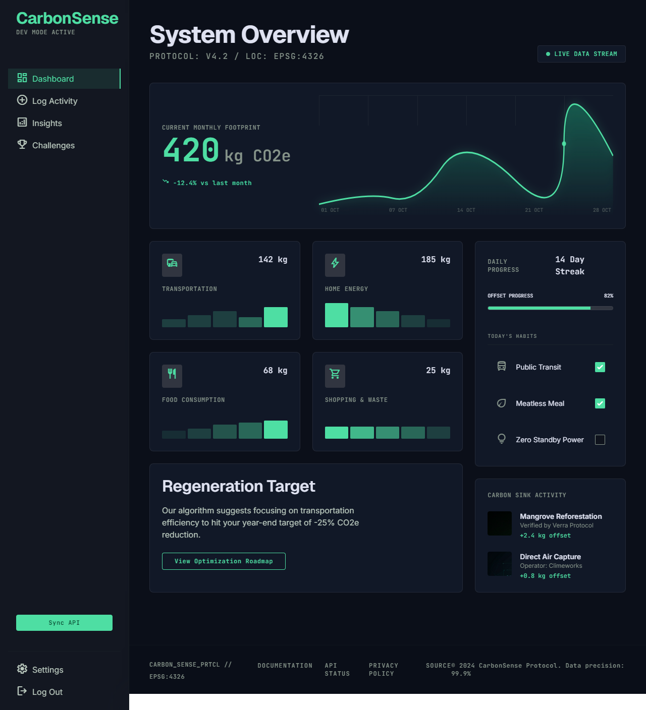
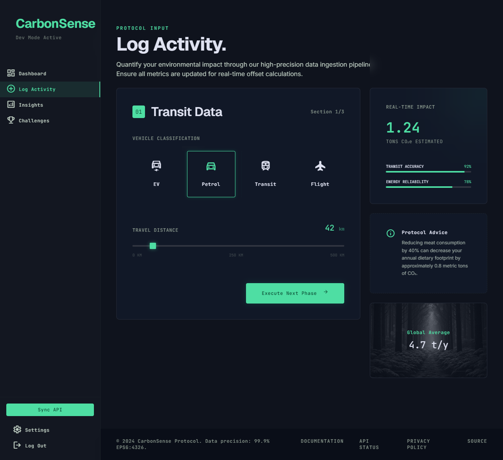
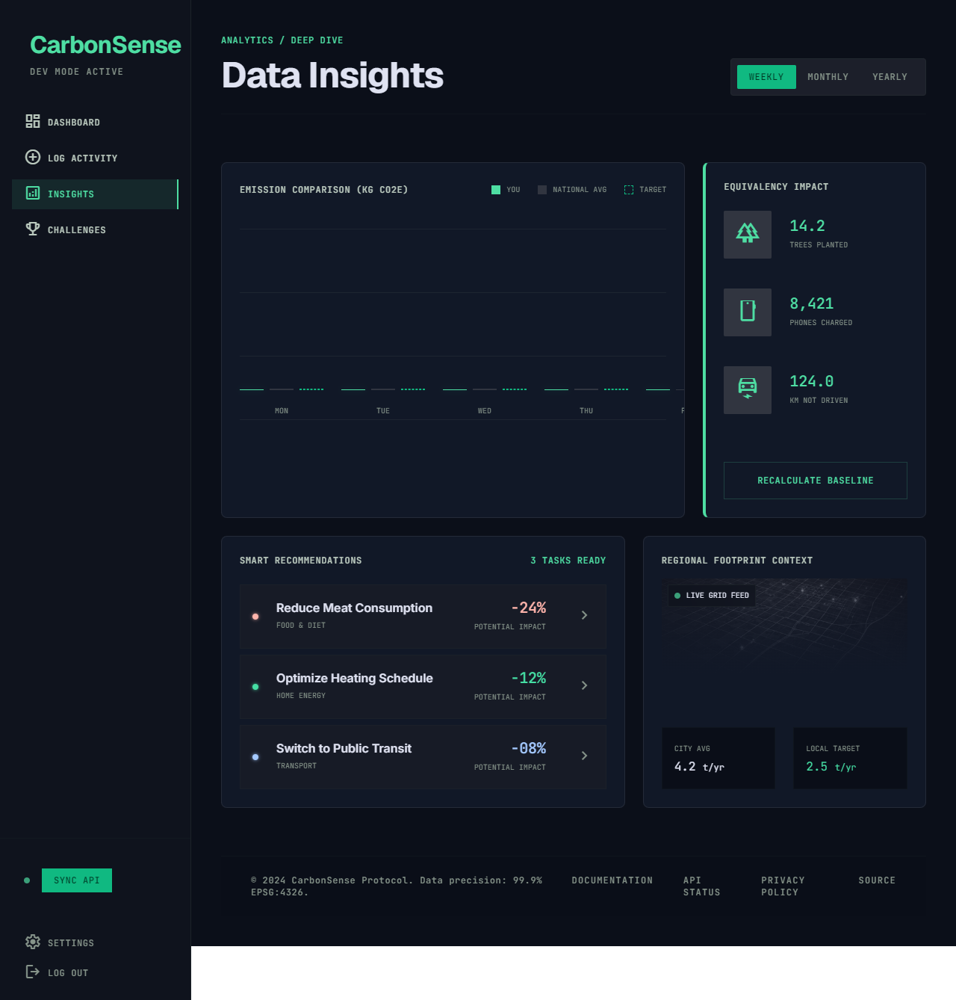
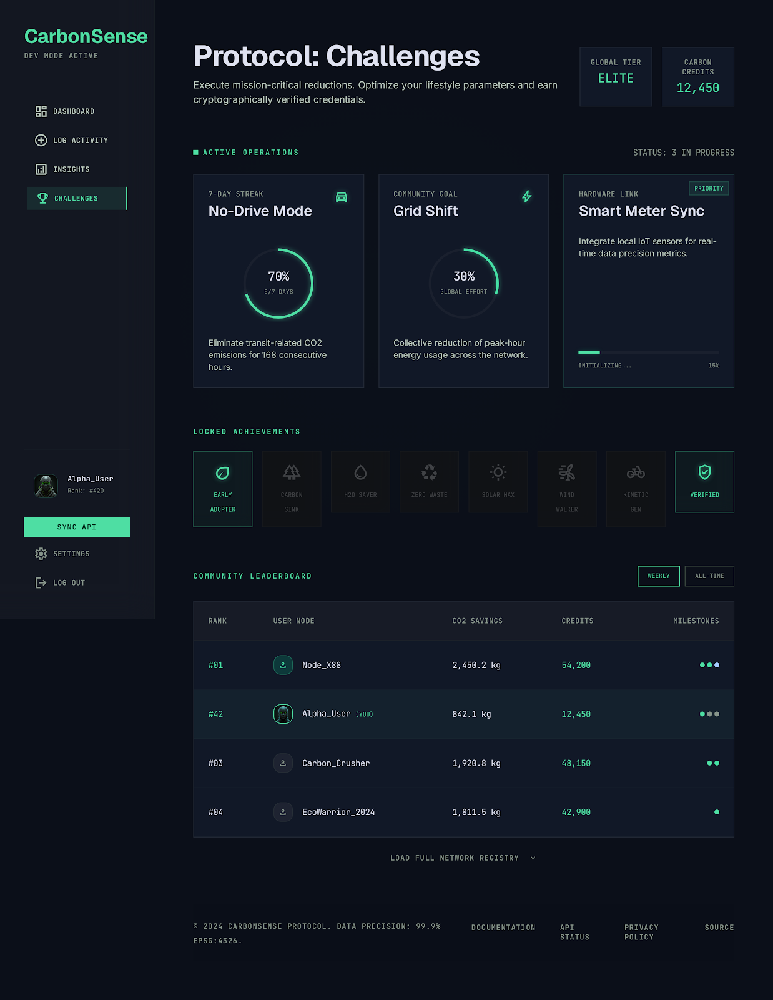

# CarbonSense

CarbonSense is a professional, high-fidelity carbon footprint tracking platform. It leverages a terminal-style telemetry design called the Kinetic Carbon Design System to deliver precise ecological monitoring, habit auditing, and verified offset tracking.

[](https://react.dev)
[](https://vitejs.dev)
[](https://tailwindcss.com)
[](https://firebase.google.com)
[](https://vitest.dev)

---

## Technical Architecture

The application is engineered using clean, modular React components coupled with a global state pipeline and Google Firebase integration.

### Core State Pipeline
* **Central Control**: A centralized context, CarbonProtocolContext, handles all telemetry data, user profile coordinates, unlocked milestones, and carbon calculations.
* **State Operations**: Action types are dispatched via React useReducer for predictable state transitions, preventing prop-drilling.
* **Sync Pipeline**: Integrates a two-way synchronization mechanism that caches data locally using localStorage and commits updates to Firestore collections.

### Verification and Ingestion
* **Redirect Authentication**: Uses Google Firebase redirect authentication handlers to bypass Cross-Origin-Opener-Policy popup blocks in modern browsers.
* **Defensive Inputs**: Sanitizes all input ranges using min/max limits and parses types strictly on the client side to avoid telemetry drift or state corruption.
* **Contrast Compliance**: Employs neon green alerts (#10B981) on high-contrast slate backgrounds (#0F131D) to maintain strict accessibility standards (WCAG AAA).

---

## Directory Layout

```text
Carbon-Sense/
├── .vscode/                 # Editor validation policies
├── backend/
│   ├── firebase.json        # Service declarations
│   ├── firestore.indexes.json # Composite indexes for leaderboards
│   └── firestore.rules      # Database containment rules
└── frontend/
    ├── src/
    │   ├── components/
    │   │   ├── shared/      # Sidebar and general MetricCard components
    │   │   ├── dashboard/   # Timeline SVG chart and StreakTracker
    │   │   ├── log/         # ActivityWizard sliding questionnaire
    │   │   └── insights/    # EquivalencyGrid and SmartRecs
    │   ├── context/         # CarbonProtocolContext state pipeline
    │   ├── firebase/        # DB and Auth configuration
    │   ├── pages/           # Dashboard, Insights, LogActivity, Challenges, Landing
    │   └── utils/           # Carbon footprint calculation engines
    ├── index.html           # Meta layout and CDNs
    ├── tailwind.config.js   # Kinetic design style overrides
    └── vite.config.js       # Bundler definitions
```

---

## Interface Telemetry

### Landing Page & Authentication Hub
Connect your node terminal, register a profile, or synchronize credentials securely from the landing page.


### System Overview (Dashboard)
Review active streams, footprint timelines, and carbon sink offsets.


### Protocol Input (Log Activity)
Log transportation distances, home utility usage, diet habits, and shopping choices.


### Data Insights
Analyze historical comparisons against national averages, inspect local targets, and view environmental translations.


### Challenges & Leaderboard
Participate in active operational goals, track achievements, and inspect the network registry.


---

## Installation & Setup

### Prerequisites
* Node.js (version 18 or higher)
* NPM or Yarn package manager
* Firebase project console access

### Configuration
1. Clone this repository to your workspace.
2. In the `frontend` folder, create a file named `.env` and configure your Firebase configuration credentials:
   ```env
   VITE_FIREBASE_API_KEY=your_api_key
   VITE_FIREBASE_AUTH_DOMAIN=your_project.firebaseapp.com
   VITE_FIREBASE_PROJECT_ID=your_project_id
   VITE_FIREBASE_STORAGE_BUCKET=your_project.appspot.com
   VITE_FIREBASE_MESSAGING_SENDER_ID=your_sender_id
   VITE_FIREBASE_APP_ID=your_app_id
   ```

### Execution
1. Navigate to the frontend directory:
   ```bash
   cd frontend
   ```
2. Install the node modules:
   ```bash
   npm install
   ```
3. Start the Vite hot-reloading development server:
   ```bash
   npm run dev
   ```
4. Access the client terminal at `http://localhost:5173`.

---

## Testing & Quality Verification

Run the vitest suite to verify calculation calculations and widget integrations:
```bash
cd frontend
npm run test
```

### Verification Targets
* **Equivalency Engine**: Asserts CO₂ translations to tree absorption rate metrics are mathematically precise.
* **Activity Ingestion**: Validates range constraints and confirms the real-time preview dashboard updates instantly when sliders move.
* **Auth Boundaries**: Tests redirect state capture rules and Firestore synchronization handshakes.
